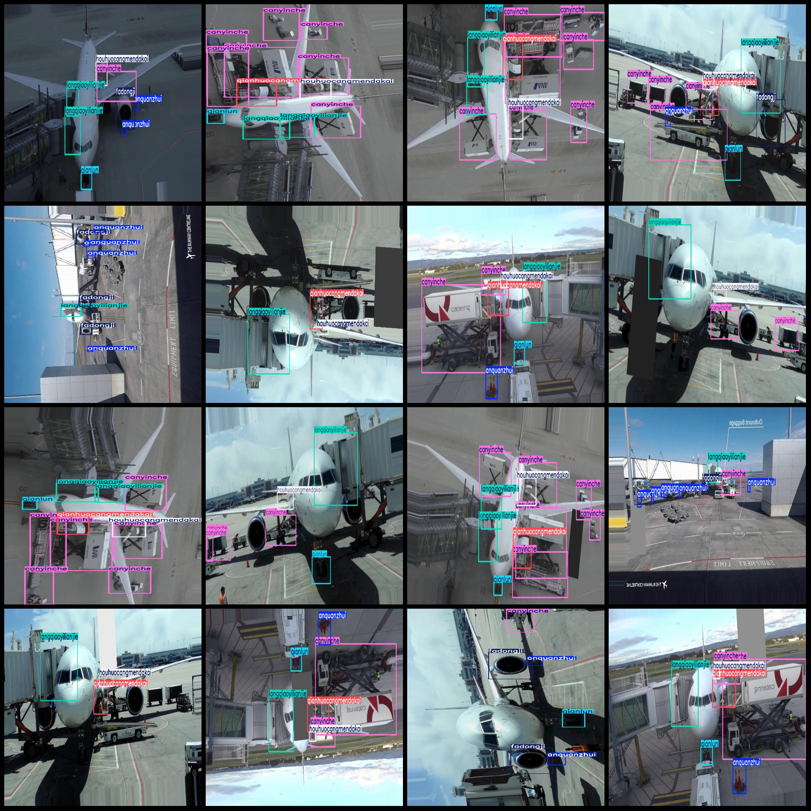
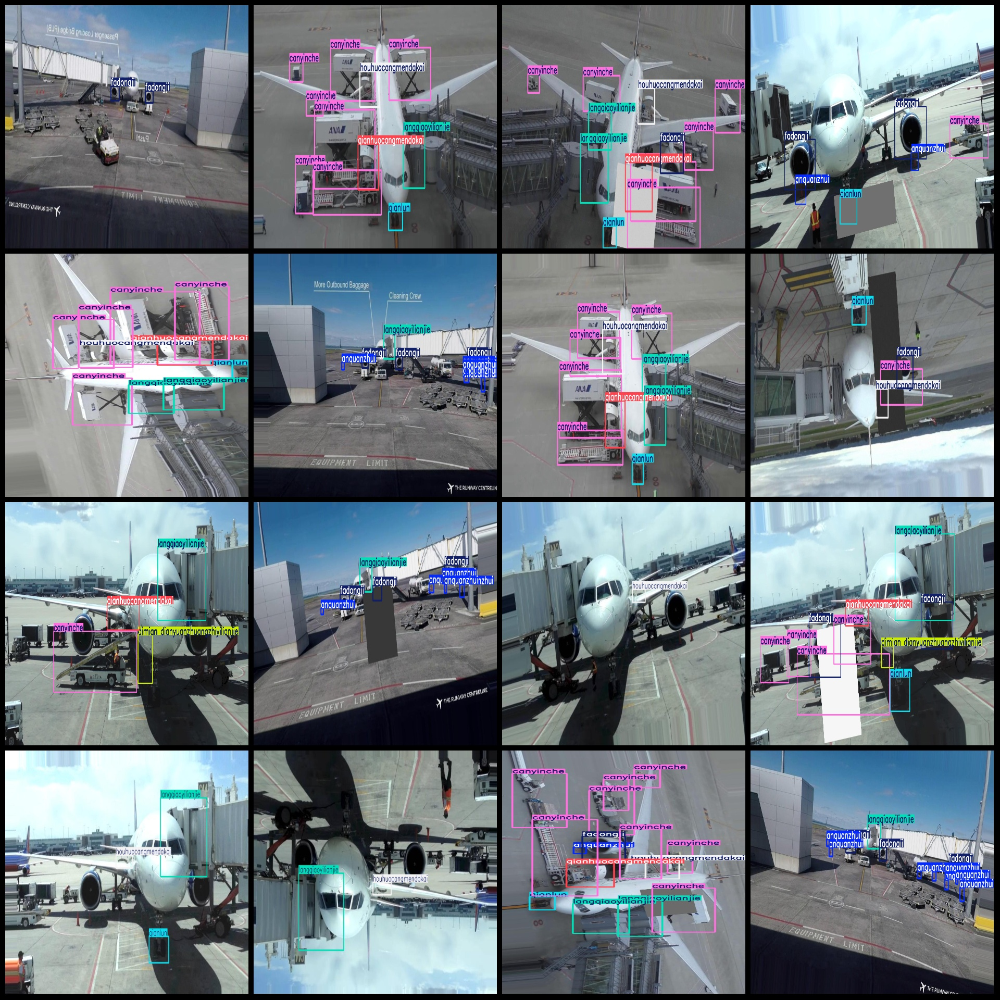

# Aerial Ground Operations Detection Dataset in VOC+YOLO Format with 8702 Images and 8 Categories

Please note that in the dataset, there are some images enhanced. The main purpose is to change the color of an image's specific area into gray or black. You can refer to the image for details.
Dataset format: Pascal VOC format+YOLO format (without split path in txtfile, just containing jpg image and corresponding VOC format xmlfile and yolo format txtfile)
number of images: 8702  
annotation count: 8702  
annotation count: 8702  
annotationnumber of classes: 8  
["anquanzhui", "canyinche", "dimian dianyuanzhuangzhiyilianjie", "fadongji", "houhuocangmendakai", "langqiaoyilianjie", "qianhuocangmendakai", "qianlun"]
["Safe cone", "Dining car", "Ground power device connected", "Engine", "After cargo compartment door opened", "Lantern bridge connected", "Front cargo compartment door opened", "Front wheel"]
boxes per class:   
anquanzhui = 8501
canyinche box count = 23428  
Dimian Dianyuanzhuangzhiyilianjie Frame Count = 1259
fadongji box count = 5851  
houhuocangmendakai box count = 6274  
langqiaoyilianjie box count = 9836  
"qianhuocangmendakai box count = 4860" is a Chinese sentence translated to English. Here is the translation:

"The number of frames in the Qianhuo Cangmendaikai project is 4860."
"qianlun" is a Chinese character, which means "quantity" or "amount", and it translates to "quantity" in English. The numeric value "5737" translates to "5737" in English.
Total frames: 65746
images per class:   
anquanzhui images = 3845  
canyinche images = 6610  
Dimian Dianyuanzhuangzhiyilianjie occupies the number of pictures = 1259
The number of pictures owned by FADongji = 3840.
"houhuocangmendakai images = 6274" is a Chinese sentence translated into English. Here's the translation:

```
The number of photos owned by Huohuocang Mengdaikai is equal to 6274.
```
The number of pictures owned = 7048.
qianhuocangmendakai images = 4860  
qianlun images = 5737  
Image resolution: Multi-resolution images, such as 1280x720, 1440x2560, etc.
Used annotation tool: labelImg
Annotation rules: Draw a rectangle box around the class
Important notes: The dataset does not have a training/validation/test set division; you need to divide it yourself.
Special statement: This dataset does not guarantee any accuracy for the trained models or weight files.
Image preview:
## Images





Here is a pay link on Stripe ( https://buy.stripe.com/3cs8yP7sY87d0vu9AB ). Please contact me lonlonago@foxmail.com after funding $89, and I will send you a complete data files , thank you!

